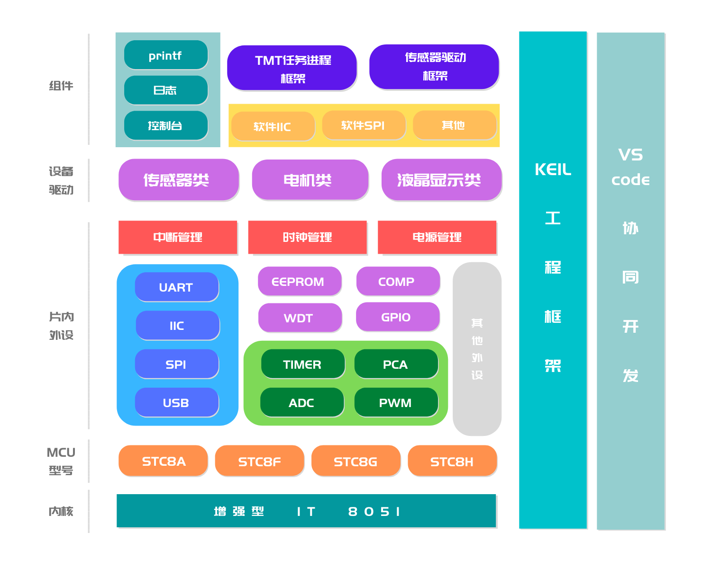

# 8051-ELL 简介

<font color=#0CCDD>[<u>**8051-ELL文档中心**</u>](https://8051-ell-web.vercel.app/#/)</font>     <font color=#0BBEE>[<u>**API在线手册**</u>](https://8051-ell-api.vercel.app/index.html)</font>   

[](https://github.com/zewen-i/8051-ELL-LIB) <a href='https://gitee.com/zeweni/ELL-8051-LIB/stargazers'></img></a> <a href='https://gitee.com/zeweni/ELL-8051-LIB/members'></img></a>

8051-ELL，是根据新一代增强型8051为内核的MCU，基于keil开发的硬件抽象平台。ELL库充分考虑8051的特性，结合硬件条件，提供了大量标准的API函数，供开发者访问底层硬件细节。ELL的大小支持裁剪，在代码密度和执行效率上做到了很好的平衡。

ELL是`efficient low-layer`的缩写，意思是`高效低封装`，结合了`HAL库`和`LL库`的编程思想，既保证了通用性又降低了flash的过度占用。可谓是一举两得，高效、简洁、好用！

8051-ELL库支持Keil4和Keil5，支持Vscode协同开发，推荐使用EIDE插件。目前ELL库主要适配了STC公司的单片机型号，以STC8系列为主。后续计划增加STC12、STC15、STC16系列。


函数库遵循 Apache 许可证 2.0 版本，可免费在商业产品中使用，不需要公布应用程序源码，没有潜在商业风险。


大家觉得好用的话，记得给个`Star`，我想上自荐！！！！


****
当前版本为：`1.1.6.0725`

B站账号：泽文i

QQ技术支持群：` 1001220381`


****


## 新手如何入门


进入 <font color=#0CCDD>[<u>**8051-ELL文档中心**</u>](https://8051-ell-web.vercel.app/#/)</font>  可查看 <font color=#0CCDD>[<u>**入门教程**</u>](https://8051-ell-web.vercel.app/#/zh-cn/start/start)</font> 。


ELL采用了一个裸机框架来组织库文件。框架包括两大部分：`工程文件`和`库文件`。

工程文件主要存放`Keil工程`、`Vscode文件`、`用户代码`。这里可以根据你的编程习惯进行安排，非常的自由！库文件才是我们的重头戏，它主要分为四个部分：`核心文件夹`、`片内外设库`、`组件库`、`设备驱动库`。其中`组件库`和`设备驱动库`单独发展，不放在本仓库内。

### ELL仓库目录结构


| 一级目录  |  二级目录   |        描述         |
| :-------: | :---------: | :-----------------: |
|    doc    |     ...     |    一些文档资料     |
| examples  |     ---     |      示例代码       |
|           |   STC8Ax    | STC8A系列的示例代码 |
|           |   STC8Cx    | STC8C系列的示例代码 |
|           |     ...     |      其他型号       |
| libraries |     ---     |      ELL库文件      |
|           |    core     |  寄存器和启动文件   |
|           | peripherals |  芯片的片内外设库   |
|  project  |     ---     |      模板工程       |
|           |   STC8Ax    | STC8A系列的模板工程 |
|           |   STC8Cx    | STC8C系列的模板工程 |
|           |     ...     |      其他型号       |


下面是ELL库的框架图:



整个固件库，充分利用了keil的一些特性，比如使用LX51扩展链接器/定位器，优化了BL51的功能，可以生成更小的目标文件等。


# 源代码阅读指导


## 一、基本架构

设计框架上，ELL分为三个组成部分，分别是片内外设库、组件库、设备驱动库。片内外外设库是核心库，包含MCU的片内外设驱动，是ELL的核心组成；组件库和设备驱动库，开放给开发者，可以编写自己的驱动和移植软件包。

文件细节上，ELL有lib文件夹和project文件夹组成。

lib文件夹包含startup文件夹、core文件夹、peripherals文件夹。startup文件夹存放启动代码，是汇编语言；core文件夹存放MCU的寄存器文件和ELL核心数据类型文件，同时它还负责管理MCU的中断（比如定义中断号）；其他文件夹和设计框架一一对应。

project文件夹，存放Keil-C51工程，后续会支持IAR和SDCC。具体包含main文件夹、application文件夹、build文件夹。main文件夹存放系统的初始化文件和中断服务函数文件；application文件夹存放开发者自己的代码；build文件夹存放编译的烧录文件和汇编文件。


## 二、数据结构

ELL采用了面向对象的封装思想，但是考虑51的资源和性能，又做了一些调整和取舍。对于同类外设，且工作模式的外设，采用结构体+枚举体的方式封装；对于单个外设，且比较抽象的，采用函数传参完成封装，但是传参的参数，仍然采用枚举体或者格式统一的宏来封装。


结构体+枚举体的封装里，枚举体作为结构体成员，主要是负责某一个功能或参数的设置，而包含这些枚举体成员的结构体，往往代表一个外设的全部信息。


除此之外，ELL灵活运用了宏的特性，具体有宏函数、控制宏、宏传参。宏函数是对寄存器操作进行封装，以保证执行效率的同时，提高可读性；控制宏用来裁剪ELL的功能和做一些配置工作。


# 支持的型号及外设

> `√`代表已经支持、`空`代表MCU没有这个外设、 ` X`代表还没有适配


### STC8系列

部分型号可能有所差异，详情可查看官方数据手册。

| 型号      | 定时器 | IO   | 中断 | 系统时钟 | PCA  | PWM  | MPWM | HPWM | EEPROM | ADC  | MDU16 | 比较器 | USB  | LED | RTC | TKEY |
| --------- | ----- | ---- | ---- | -------- | ---- | ---- | ---- | ------ | ---- | ----- | ------ | ---- | ---- | ---- | ---- | ---- |
| STC8A系列 | √      | √    | √    | √       | √    | √    | X    | X   | √      | √    |       | √      |      |      |      |      |
| STC8C系列 | √      | √    | √    | √       |      |      |      |      | √      |      | √     | √      |      |      |      |      |
| STC8F系列 | √      | √    | √    | √       |    |      |      |      | √      |      |       | √      |      |      |      |      |
| STC8G系列 | √      | √    | √    | √       | √    |   | √ |      | √      | √    | √     | √      | X | X |      |      |
| STC8H系列 | √      | √    | √    | √       |     |      |  | X | √      | √    | √     | √      | X | X | X | X |


# 联合开发

## 一、代码编写准则

1.宏命名：全部采用字母大写；
```C
宏函数：

    #define NVIC_COMP_CTRL(run)    do{CMPCR1 = (CMPCR1 & 0xCF)|(run << 4);}while(0)

普通宏：

    #define PER_LIB_COMP_CTRL 1


```

2.变量命名：采用动宾结构，单词过长要缩写（保留三个字母），单词之间用`_`连接全局变量说明：要加前缀'G_'
  局部变量说明：首字母小写

```C

全局变量：

    uint8_t G_Uart_Busy_Flg = 0; //Busy flag of receive

局部变量：

    uint32_t sysClk_FRE;
```

5.函数命名：名字+动作形式，单词首字母大写，单词之间用`_`连接
  函数传参说明：首字母小写

```C

FSCSTATE MPWMn_Port_Init(MPWMPort_Type port, MPWMCLKSrc_Type clkSrc, uint16_t period)
{
    ...
}
```

6.代码注释规范：采用Doxygen规范，具体细节可参考库源代码。
```C

/**
 * @brief     PWM端口初始化函数。Init PWM port function.
 * @details   初始化指定端口(0-5)。Init the specified PWM port. (from 0 to 5)
 * @param[in] port PWM端口枚举体。PWM port enumerator.
 * @param[in] clkSrc PWM时钟源。PWM clock source.
 * @param[in] period PWM周期值（计数器重装载值）。PWM period value (counter reload value)
 * @return    FSC_SUCCESS 返回成功。Return to success.
 * @return    FSC_FAIL    返回失败。Return to fail.
**/

```

7.利用代码注释，ELL对C文件和H文件做了区域划分，使得代码管理更加规范。

```C

/*-----------------------------------------------------------------------
|                            FILE DESCRIPTION                           |
-----------------------------------------------------------------------*/
/*----------------------------------------------------------------------
  - File name     : xxx.c
  - Author        : zeweni
  - Update date   : 2020.01.11
  -	Copyright(C)  : 2020-2021 zeweni. All rights reserved.
-----------------------------------------------------------------------*/
/*------------------------------------------------------------------------
|                            COPYRIGHT NOTICE                            |
------------------------------------------------------------------------*/
/*
 * Copyright (C) 2021, zeweni (17870070675@163.com)

 * This file is part of 8051 ELL low-layer libraries.

 * 8051 ELL low-layer libraries is free software: you can redistribute 
 * it and/or modify it under the terms of the Apache-2.0 License.

 * 8051 ELL low-layer libraries is distributed in the hope that it will 
 * be useful,but WITHOUT ANY WARRANTY; without even the implied warranty 
 * of MERCHANTABILITY or FITNESS FOR A PARTICULAR PURPOSE. See the 
 * Apache-2.0 License for more details.

 * You should have received a copy of the Apache-2.0 License.8051 ELL 
 * low-layer libraries. If not, see <http://www.apache.org/licenses/>.
**/
/*-----------------------------------------------------------------------
|                               INCLUDES                                |
-----------------------------------------------------------------------*/

/*-----------------------------------------------------------------------
|                                 DATA                                  |
-----------------------------------------------------------------------*/

/*-----------------------------------------------------------------------
|                               FUNCTION                                |
-----------------------------------------------------------------------*/

/*-----------------------------------------------------------------------
|                   END OF FLIE.  (C) COPYRIGHT zeweni                  |
-----------------------------------------------------------------------*/

```


## 二、模块开发指导

ELL使用git管理源代码，使用gitee作为主仓库，github作为备份仓库。如果想要成为ELL的开发者，请以gitee仓库为主。


### 一、Fork本仓库


首先fork本仓库当你的账户下，然后在此基础上做开发。


### 二、开发代码


#### 1.寄存器

为了保持统一的风格，以及最大程度的灵活性，ELL的开发会细致到寄存器的开发。但是寄存器头文件仍然是沿用官方给出的命名规则，以保证兼容性，但是寄存器的编写和安排，以模块化放置。寄存器头文件存放的位置在libraries/core/register/xxx型号。


#### 2.数据结构

可以参考上文的源代码阅读指导，核心内容就是结构体+枚举体+宏的形式，特点是对宏的封装。


#### 3.API函数

可以参考任意一个模块来设计。


### 三、提交PR和Issue


再完成代码开发以后，你可以发布PR请求合并，同时在Issue里面做详细解释。管理员再审核过你的代码后，会将你的PR合并到主仓库。


# 技术交流群

欢迎加群，在这里可以帮你解决学习ELL库遇到的问题。

 > 
